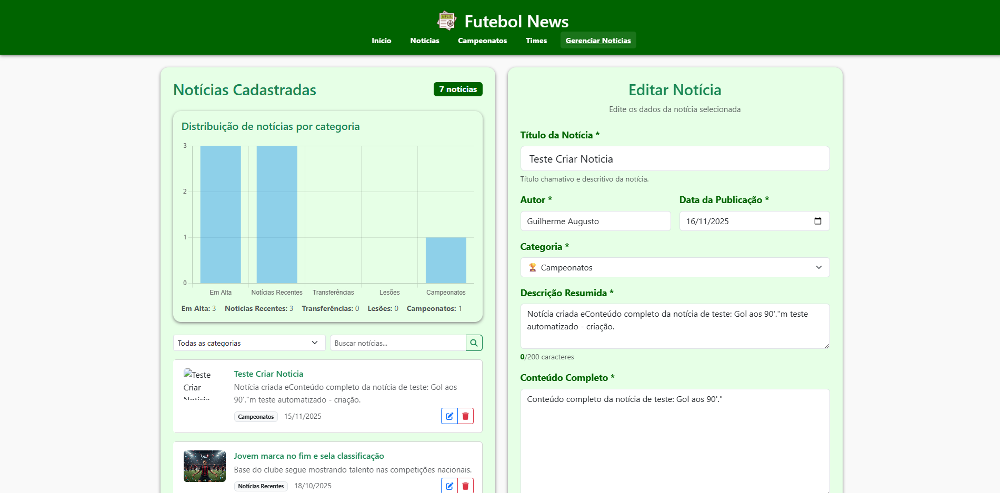
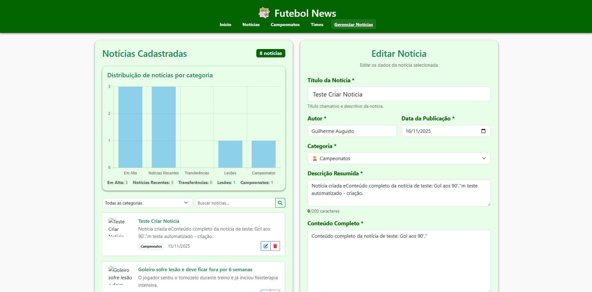

# Trabalho Prático 07 - Semanas 13 e 14

A partir dos dados cadastrados na etapa anterior, vamos trabalhar formas de apresentação que representem de forma clara e interativa as informações do seu projeto. Você poderá usar gráficos (barra, linha, pizza), mapas, calendários ou outras formas de visualização. Seu desafio é entregar uma página Web que organize, processe e exiba os dados de forma compreensível e esteticamente agradável.

Com base nos tipos de projetos escohidos, você deve propor **visualizações que estimulem a interpretação, agrupamento e exibição criativa dos dados**, trabalhando tanto a lógica quanto o design da aplicação.

Sugerimos o uso das seguintes ferramentas acessíveis: [FullCalendar](https://fullcalendar.io/), [Chart.js](https://www.chartjs.org/), [Mapbox](https://docs.mapbox.com/api/), para citar algumas.

## Informações do trabalho

- Nome: Guilherme Augusto Martins de Carvalho
- Matricula: 903025
- Proposta de projeto escolhida: Temas e Conteúdos Associados (Entidade Principal (Tema): Futebol | Entidade Secundária (Conteúdos/Recursos): Notícias, jogos, tabela de classificação transferências, etc.)
- Breve descrição sobre seu projeto: Portal de notícias e informações sobre futebol brasileiro e mundial (Futebol News)

**Print da tela com a implementação**

<< Nesta etapa foram implementadas duas melhorias principais no sistema:

A nova página noticias.html, responsável por listar todas as notícias cadastradas, incluindo filtros e busca dinâmica para facilitar a navegação.

O gráfico de categorias, criado com Chart.js, que exibe automaticamente a quantidade de notícias por categoria, sendo atualizado conforme os dados do servidor. >>

<<   >>

<<   >>
